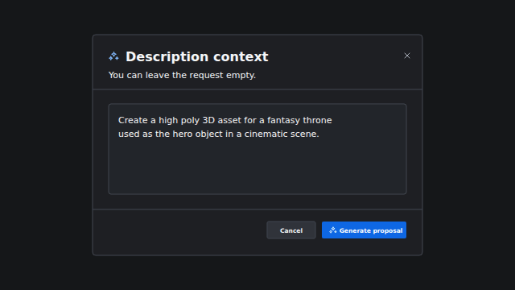
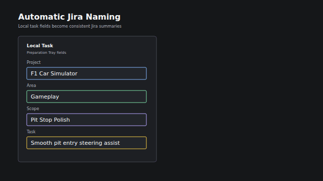
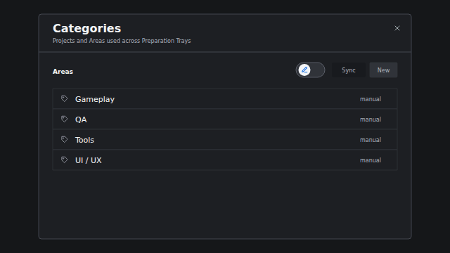
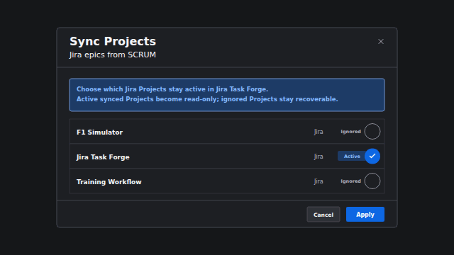
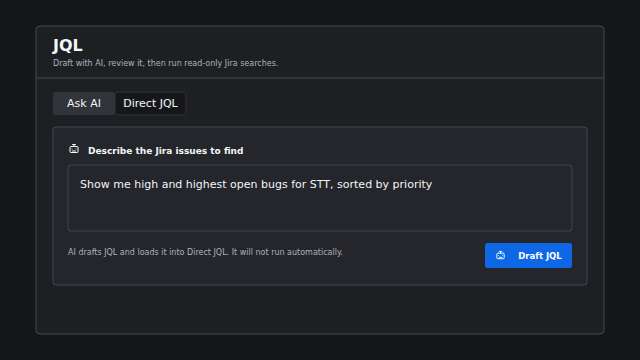

<p align="center"><a href="README.md">English</a> | <a href="README.es.md">Español</a></p>

# Jira Task Forge

Jira Task Forge es una aplicación local para Windows que transforma trabajo de
producción todavía incompleto en tareas de Jira revisadas. Permite capturar
notas, organizar tareas, preparar descripciones consistentes y decidir qué está
realmente listo antes de enviar contenido a Jira Cloud.

### Descargar la beta

Descarga la beta pública actual desde
[GitHub Releases](https://github.com/salmonsimon/jira-task-forge/releases/tag/v0.1.0-beta.1).
El instalador no está firmado, por lo que Windows SmartScreen puede mostrar una
advertencia. Reporta problemas reproducibles mediante
[GitHub Issues](https://github.com/salmonsimon/jira-task-forge/issues).

## Contexto

El trabajo rara vez comienza como una tarea lista para Jira. Puede partir como
una nota de producción, un hallazgo de QA, un acuerdo de reunión o una
conversación con IA que todavía necesita alcance, evidencia y revisión.

Jira Task Forge mantiene ese trabajo inicial en una **bandeja de preparación**
(`Preparation Tray`): un grupo de trabajo local donde las tareas relacionadas
se organizan por proyecto y área, se completan y se revisan juntas. Cuando la
bandeja está lista, la aplicación puede crear las Epics necesarias, Stories o
Bugs principales, subtareas aceptadas, adjuntos seleccionados y relaciones
`blocks` o `blocked by` entre tareas.

## Crear descripciones asistidas por IA

Jira Task Forge puede redactar descripciones para Stories y Bugs mediante
OpenAI, Anthropic Claude o Google Gemini. El resultado permanece como una
propuesta local en vez de enviarse directamente a Jira. En **Proposal review**,
cada sección puede aceptarse, rechazarse, editarse manualmente o devolverse a la
IA con más contexto.

<p align="center">
  
</p>

Las plantillas de Story y Bug utilizan secciones Markdown predecibles, para que
la descripción final sea fácil de leer en Jira y de revisar antes de crearla:

<table align="center">
<tr>
<th width="50%">Story</th>
<th width="50%">Bug</th>
</tr>
<tr>
<td width="50%" valign="top"><pre><code>&#35;&#35; Historia de usuario&#10;&#10;&#35;&#35; Contexto&#10;&#10;&#35;&#35; Alcance&#10;&#10;&#35;&#35; Criterios de aceptación&#10;&#10;&#35;&#35; Entregable mínimo&#10;&#10;&#35;&#35; Checklist antes de Review</code></pre></td>
<td width="50%" valign="top"><pre><code>&#35;&#35; Problema&#10;&#10;&#35;&#35; Contexto e impacto&#10;&#10;&#35;&#35; Pasos para reproducir&#10;&#10;&#35;&#35; Resultado actual&#10;&#10;&#35;&#35; Resultado esperado&#10;&#10;&#35;&#35; Evidencia&#10;&#10;&#35;&#35; Criterios de aceptación&#10;&#10;&#35;&#35; Entregable mínimo&#10;&#10;&#35;&#35; Checklist antes de Review</code></pre></td>
</tr>
</table>

## Mantener nombres consistentes en Jira

Jira Task Forge deriva los nombres de Jira desde los campos locales revisados:

- Epic: `[{Project}] [{Area}] {Scope}`
- Story o Bug: `[{Area}] {Nombre de la tarea}`

La siguiente animación muestra cómo esos campos se convierten en nombres de
Jira en la práctica.

<p align="center">
  
</p>

## Administrar categorías desde sus fuentes reales

### Áreas: modo manual o Notion

Las áreas pueden mantenerse directamente en Jira Task Forge o sincronizarse
desde un catálogo de Notion. El modo manual ofrece la configuración más corta.
La sincronización con Notion entrega una fuente reutilizable para áreas,
etiquetas de Jira, tipos de tarea, formatos de entrega y las reglas que definen
cada entregable mínimo.

<p align="center">
  
</p>

La [Guía de sincronización del catálogo](docs/catalog-sync.es.md) entrega un
paso a paso para copiar el ejemplo público a tu propio espacio de Notion,
autorizar esa página y sincronizar sus áreas y requisitos de entrega. Así, las
opciones disponibles y la estructura esperada de cada tarea se mantienen
consistentes durante la preparación.

### Proyectos: modo manual o Jira

Los proyectos también pueden mantenerse manualmente o descubrirse desde Jira.
La sincronización analiza los nombres de las Epics de Jira mediante el formato
definido arriba: `[{Project}] [{Area}] {Scope}`. El asistente de revisión permite
elegir qué proyectos descubiertos quedan activos y cuáles permanecen ignorados,
pero recuperables.

<p align="center">
  
</p>

## Buscar en Jira con JQL asistido

El espacio de JQL ofrece dos caminos. Puedes escribir JQL directamente cuando
conoces la sintaxis, o describir las tareas en lenguaje normal para que el
proveedor de IA configurado redacte el JQL equivalente. La consulta generada se
carga en **Direct JQL** para revisión y no se ejecuta automáticamente.

Por ejemplo, `Muéstrame los bugs abiertos High y Highest de STT, ordenados por
prioridad` puede convertirse en:

```jql
project = STT AND issuetype = Bug AND priority in (High, Highest)
AND statusCategory != Done ORDER BY priority DESC
```

<p align="center">
  
</p>

Las consultas son de solo lectura. Después de revisar el JQL final puedes
ejecutarlo, guardarlo como favorito y volver a las consultas recientes.

## Datos locales y credenciales

Jira Task Forge prioriza el trabajo local: la mayor parte de lo que preparas
permanece en tu computador hasta que decides crearlo en Jira. Las credenciales
sensibles, como los tokens de Jira y Notion o las claves de los proveedores de
IA, se guardan en Windows Credential Manager y no junto a los datos habituales
de la aplicación. Así, Windows protege los secretos más importantes de la
persona usuaria.

Los adjuntos seleccionados se copian al almacenamiento administrado por la
aplicación mientras se prepara una tarea. Cuando un adjunto destinado a Jira se
sube correctamente, Jira Task Forge elimina sus bytes locales administrados y
conserva solamente los metadatos necesarios para el historial local. Los
archivos usados solo por IA se eliminan cuando la tarea alcanza el estado
`Created`; eliminar una tarea editable, una bandeja o un adjunto también elimina
sus archivos administrados.

Lee [Instalación y seguridad](docs/installation-security.es.md) para conocer los
límites completos de almacenamiento, credenciales y conexiones de red.

## Documentación

- [Instalación y seguridad](docs/installation-security.es.md)
- [Limitaciones conocidas de la beta](docs/beta-limitations.es.md)
- [Guía de sincronización del catálogo](docs/catalog-sync.es.md)
- [Crear y alojar tu propia conexión pública OAuth de Notion](docs/notion-oauth-public-connection.es.md)
  es solo para quienes mantienen un fork o una versión autohospedada. Las
  personas que usan la aplicación estándar no necesitan esta configuración.

Jira Task Forge es un proyecto personal y abierto, pensado para que otras
personas puedan usarlo, inspeccionarlo, adaptarlo y crear sus propias versiones.
Actualmente la aplicación solo funciona en Windows.
